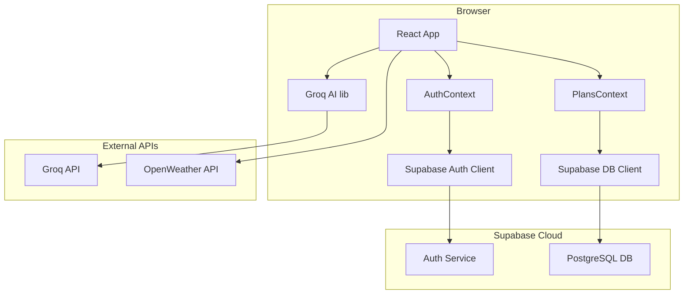

# Design Document — User Plans & Authentication

## Overview

This feature adds a full user identity and persistence layer to YatraSathi. Users can register, log in, create named travel plans, save AI-generated outputs from any planning page into those plans, view version history, run AI analysis, chat with AI scoped to a plan, and receive cross-plan trip recommendations. The implementation uses **Supabase** for authentication and database persistence, and the existing **Groq AI API** for all AI features.

The existing React + Vite + TypeScript + Chakra UI codebase is extended — no pages are removed or broken. All new UI follows the existing `theme.ts` glass-card aesthetic.

---

## Architecture



**Key architectural decisions:**
- All Supabase calls happen client-side via the `@supabase/supabase-js` SDK (same pattern as existing Groq/weather calls).
- A React Context (`AuthContext`) wraps the app and exposes the current user session.
- A second React Context (`PlansContext`) provides CRUD operations for plans and sections.
- Route guards are implemented as a `ProtectedRoute` wrapper component.
- No new backend server is introduced — Supabase's Row Level Security (RLS) policies enforce data isolation per user.

---

## Components and Interfaces

### New Pages
| Route | Component | Access |
|---|---|---|
| `/login` | `LoginPage` | Unauthenticated only |
| `/signup` | `SignupPage` | Unauthenticated only |
| `/dashboard` | `DashboardPage` | Authenticated only |
| `/plans/:planId` | `PlanDetailPage` | Authenticated only |

### New Components
| Component | Purpose |
|---|---|
| `AuthContext` | Global auth state, login/logout/signup methods |
| `PlansContext` | Global plans CRUD, section save, version management |
| `ProtectedRoute` | Redirects unauthenticated users to `/login` |
| `GuestRoute` | Redirects authenticated users to `/dashboard` |
| `NavbarUserMenu` | Avatar + "+" icon injected into existing Navbar |
| `CreatePlanModal` | Modal prompt for plan name input |
| `SaveToPlanButton` | Reusable button shown on each planning page after AI output |
| `PlanCard` | Dashboard summary card per plan |
| `PlanVersionHistory` | Version list with restore button |
| `PlanAnalysisPanel` | Displays AI analysis, "Analyse" button |
| `PlanChatPanel` | Chat UI scoped to a plan |
| `WeatherSnapshotCard` | Displays auto-captured weather for source + destination |
| `PlanRecommendationPanel` | Dashboard panel for cross-plan AI ranking |

### Existing Pages Modified
Each of the 8 planning pages gains a `<SaveToPlanButton>` rendered conditionally after AI output is available. No existing logic is changed.

---

## Data Models

### Supabase Tables

```sql
-- Users are managed by Supabase Auth (auth.users table)

CREATE TABLE plans (
  id          UUID PRIMARY KEY DEFAULT gen_random_uuid(),
  user_id     UUID NOT NULL REFERENCES auth.users(id) ON DELETE CASCADE,
  name        TEXT NOT NULL,
  destination TEXT,
  created_at  TIMESTAMPTZ NOT NULL DEFAULT now(),
  updated_at  TIMESTAMPTZ NOT NULL DEFAULT now()
);

CREATE TABLE plan_sections (
  id           UUID PRIMARY KEY DEFAULT gen_random_uuid(),
  plan_id      UUID NOT NULL REFERENCES plans(id) ON DELETE CASCADE,
  section_type TEXT NOT NULL, -- 'planner'|'budget'|'hotels'|'food'|'transport'|'safety'|'best-time'|'weather'
  data         JSONB NOT NULL,
  saved_at     TIMESTAMPTZ NOT NULL DEFAULT now()
);

CREATE TABLE plan_versions (
  id          UUID PRIMARY KEY DEFAULT gen_random_uuid(),
  plan_id     UUID NOT NULL REFERENCES plans(id) ON DELETE CASCADE,
  snapshot    JSONB NOT NULL, -- full array of plan_sections at time of snapshot
  created_at  TIMESTAMPTZ NOT NULL DEFAULT now()
);

CREATE TABLE plan_analyses (
  id          UUID PRIMARY KEY DEFAULT gen_random_uuid(),
  plan_id     UUID NOT NULL REFERENCES plans(id) ON DELETE CASCADE,
  content     TEXT NOT NULL,
  created_at  TIMESTAMPTZ NOT NULL DEFAULT now()
);

CREATE TABLE weather_snapshots (
  id           UUID PRIMARY KEY DEFAULT gen_random_uuid(),
  plan_id      UUID NOT NULL REFERENCES plans(id) ON DELETE CASCADE,
  source_data  JSONB,
  dest_data    JSONB,
  captured_at  TIMESTAMPTZ NOT NULL DEFAULT now()
);
```

### TypeScript Types (additions to `src/types/index.ts`)

```typescript
export type SectionType =
  | 'planner' | 'budget' | 'hotels' | 'food'
  | 'transport' | 'safety' | 'best-time' | 'weather';

export interface Plan {
  id: string;
  user_id: string;
  name: string;
  destination?: string;
  created_at: string;
  updated_at: string;
  sections?: PlanSection[];
  versions?: PlanVersion[];
  latestAnalysis?: PlanAnalysis;
  weatherSnapshot?: WeatherSnapshot;
}

export interface PlanSection {
  id: string;
  plan_id: string;
  section_type: SectionType;
  data: unknown;
  saved_at: string;
}

export interface PlanVersion {
  id: string;
  plan_id: string;
  snapshot: PlanSection[];
  created_at: string;
}

export interface PlanAnalysis {
  id: string;
  plan_id: string;
  content: string;
  created_at: string;
}

export interface WeatherSnapshot {
  id: string;
  plan_id: string;
  source_data?: WeatherData;
  dest_data?: WeatherData;
  captured_at: string;
}
```

---

## Correctness Properties

*A property is a characteristic or behavior that should hold true across all valid executions of a system — essentially, a formal statement about what the system should do. Properties serve as the bridge between human-readable specifications and machine-verifiable correctness guarantees.*

### Property 1: Plan version count never exceeds 4

*For any* plan, after any number of section-save operations, the total number of stored versions for that plan SHALL never exceed 4. When a 5th version would be created, the oldest version is deleted first.

**Validates: Requirements 3.4**

---

### Property 2: Saved section replaces existing section of same type

*For any* plan that already contains a section of type T, saving a new section of type T SHALL result in exactly one section of type T in the plan (the new one), not two.

**Validates: Requirements 3.3**

---

### Property 3: Plan section round-trip serialization

*For any* valid plan section data object (TripPlan, BudgetBreakdown, Hotel[], etc.), serializing it to JSONB and deserializing it back SHALL produce an object deeply equal to the original.

**Validates: Requirements 3.2**

---

### Property 4: Empty plan name rejection

*For any* string composed entirely of whitespace characters (including the empty string), submitting it as a plan name SHALL be rejected and no plan SHALL be created.

**Validates: Requirements 2.3**

---

### Property 5: Whitespace-only task description rejection (auth)

*For any* string composed entirely of whitespace characters submitted as a password, THE System SHALL reject registration and display a validation error.

**Validates: Requirements 1.2**

---

### Property 6: Version restore creates a new version

*For any* plan with at least one prior version, restoring that version SHALL result in a new version entry being created (the restored state is recorded), so the version history always reflects the restoration event.

**Validates: Requirements 4.2**

---

### Property 7: Analysis context accumulation

*For any* plan with a stored analysis, triggering a new analysis SHALL include the previous analysis text in the Groq API request payload, so that the context size is monotonically non-decreasing across successive analyses.

**Validates: Requirements 5.3**

---

### Property 8: Cross-plan recommendation requires ≥ 2 plans

*For any* user with fewer than 2 plans, requesting a recommendation SHALL not call the Groq API and SHALL display the informational message instead.

**Validates: Requirements 8.3**

---

### Property 9: Weather snapshot stored on planner save

*For any* trip planner section save that includes non-empty source and destination strings, the system SHALL attempt to fetch and store weather data for both locations, resulting in a weather snapshot record associated with the plan.

**Validates: Requirements 7.1, 7.2**

---

## Error Handling

| Scenario | Handling |
|---|---|
| Supabase auth error (wrong password) | Display inline error message; retain email field |
| Supabase DB write failure | Show toast error; do not update local state |
| Groq API timeout / error during analysis | Show error toast; do not overwrite existing analysis |
| Weather API failure for one location | Store successful location; show warning badge for failed one |
| Unauthenticated access to `/dashboard` | Redirect to `/login` with `?redirect=/dashboard` |
| Plan not found (deleted, wrong user) | Show 404-style message within `PlanDetailPage` |
| Version limit enforcement failure | Log error; surface toast; do not save new version |

---

## Testing Strategy

### Property-Based Testing

The project uses **Vitest** (already implied by the Vite setup) with **fast-check** as the property-based testing library.

- Each correctness property above MUST be implemented as a single property-based test using `fc.assert(fc.property(...))`.
- Each test MUST be tagged with a comment in the format: `// Feature: user-plans, Property N: <property text>`
- Each property test MUST run a minimum of **100 iterations** (fast-check default is 100).
- Property tests focus on pure logic functions: version trimming, section deduplication, serialization round-trips, input validation, and API payload construction.

### Unit Tests

Unit tests cover:
- `AuthContext`: login, logout, signup state transitions with mocked Supabase client.
- `PlansContext`: createPlan, saveSection, restoreVersion with mocked Supabase client.
- `SaveToPlanButton`: renders only when AI output is present; calls correct context method on confirm.
- Route guards: `ProtectedRoute` redirects unauthenticated users; `GuestRoute` redirects authenticated users.

### Integration Points

- Supabase RLS policies are tested manually in the Supabase dashboard to confirm cross-user data isolation.
- End-to-end flows (signup → create plan → save section → analyse) are covered by Vitest component tests using a mocked Supabase client.
